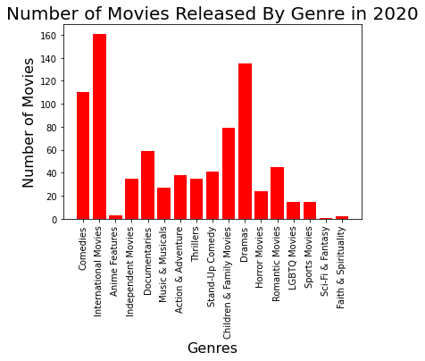

Since the rise of COVID-19 in 2020, we have all faced the effects of a Global Pandemic. In many states across the United States a “Stay-At-Home Order”, or other restrictions were put in place, ensuring many Americans were confined to the compounds of their homes. In a time where movie theaters were closed and social distancing was enforced, our means of quality entertainment was put to the test. Netflix was there to save the day, creating a "New Normal'' for Americans to binge watch Netflix, and “Chill” in the comfort of their homes, in a capacity that has never been seen before. 

Our team has chosen to analyze the effects of the 2020 Pandemic and its correlation to Netflix ratings, revenue, subscribers, and their changes over the last year. We took a deeper dive into looking at what Top 5 movies Americans were watching during the pandemic, and of the North American countries; United States, Canada, and Mexico, which produced the most TV-MA rated TV Shows in 2020. Lastly, we graphed a comparison of the number Netflix TV shows and Movies for 2020 to understand what selections Americans had to choose from. 

## Our data analytics shows….

##explain this chart

##explain this chart

This graph shows a comparison between 2019 and 2020 Netflix Revenue

here's a second look at a line graph same data

##explain this chart

mostly international movies released

