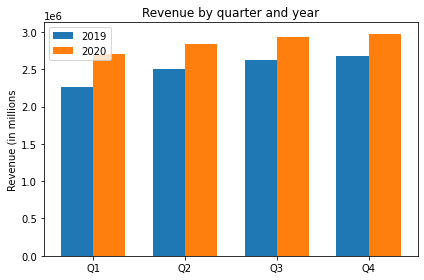
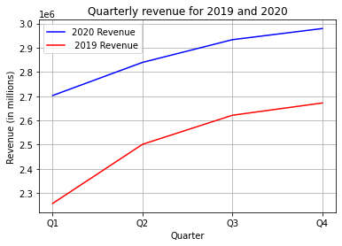
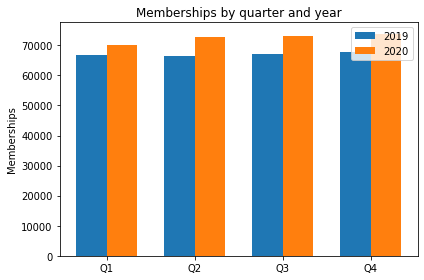
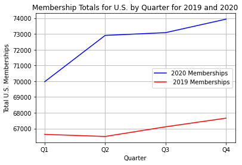
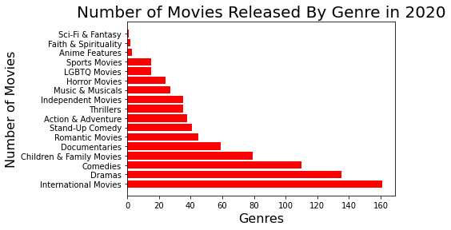
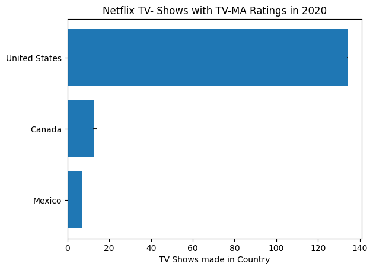
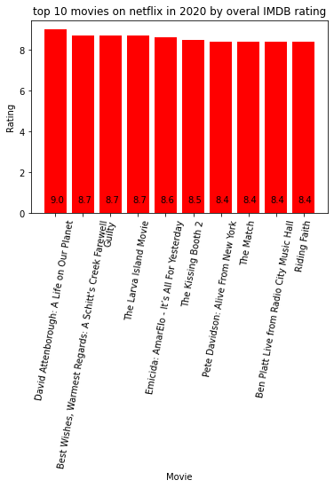
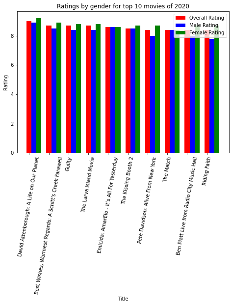
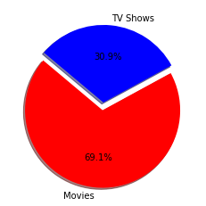
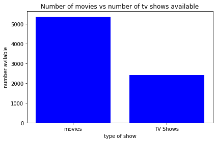

Since the rise of COVID-19 in 2020, we have all faced the effects of a Global Pandemic. In many states across the United States a “Stay-At-Home Order”, or other restrictions were put in place, ensuring many Americans were confined to the compounds of their homes. In a time where movie theaters were closed and social distancing was enforced, our means of quality entertainment was put to the test. Netflix was there to save the day, creating a "New Normal'' for Americans to binge watch Netflix, and “Chill” in the comfort of their homes, in a capacity that has never been seen before. 

Our team has chosen to analyze the effects of the 2020 Pandemic Era and its correlation to Netflix ratings, revenue, subscribers, and their changes over the last year. We took a deeper dive into looking at the number of movie releases by genre on Netflix, and of the North American countries; United States, Canada, and Mexico, which produced the most TV-MA rated TV Shows.  To take things a step further, we took a look at the top 10 movies on Netflix in 2020 based on average overall IMDB ratings and examined the correlation between male and female average movie ratings. Lastly, we graphed a comparison of the number of Netflix TV Shows and Movies for 2020 to understand what selections Americans had to choose from. 

## _Our data analytics answers the following questions:_

### _What is the difference between 2019 and 2020 Membership Subscriptions and Netflix Revenue?_

_From the graphs below, we can gather that 2020 had the heighest revenue by quarter compared to 2019._

_In comparison to the Netflix revenue, one could examine that 2020 also had the heightest membership subscriptions from 2019._

##### _To conclude, there was an increase in Netflix revenue and memberships subscriptions in 2020. This was a sucessful year for  Netflix totaling over twenty two thousand new memberships for the year and around a 1.2 million dollar average increase in revenue._

### _During a 12 month span (January 2020 to January 2021) what has been the most  released genre on Netflix during the Pandemic Era?_

_The graph below shows that there were significantly more "International Movies" released in 2020 than any other genre analyzed._ 

### _Between Canada, Mexico and The USA, which country produced the most TV - MA rated TV shows in 2020?_

_Below, a bar graph shows the United States leading the North American countries in TV-MA rated TV Shows in 2020 with nearly 140 TV Shows made in the country._ 

## _In 2020, what were the top 10 movies on Netflix based on average overall IMDB ratings?_

_Seen below is a bar graph showing what the Top 10 Movies were on Netflix in 2020. David Attenborough: A Life on Our Planet came in with a 9.0._ 

## _How did males rate these movies on average compared to famales?_

_Taking a deeper look at the ratings, this next bar graph shows an anlytical breakdown of gender ratings._  

##### _Comparatively more women rated David Attenborough: A Life on Our Planet higher than men. This bar graph also shows that with most titles women rated the movies higher, except for tyed rated titles such as Emicida:AmarElo -It's All for Yesterday and The Match._ 

## _Are there more TV shows or movies available on Netflix?_

_Lastly, our graph shows a total percent of movies and TV Shows, suggesting viewers had 69.1% more movie options than the 30.9% of TV Shows available._ 

### _So does the duration of the two mediums impact the ratings? Let's take a look._ 

